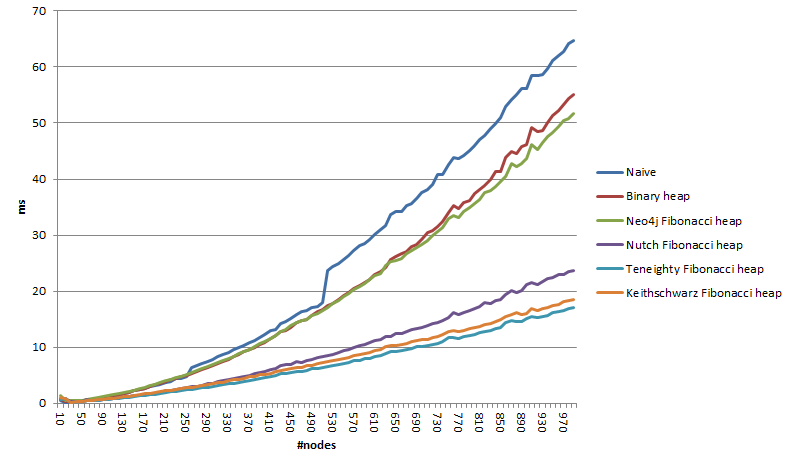

# Dijkstra Algoritması

### Uygulamanın Amacı

Uygulamada kullanıcıdan pozitif ağırlıklı graf seçtirilerek ve bir kaynak düğüm girmesi istenerek bu kaynak düğümle, diğer düğümler arasındaki en kısa mesafelerin hesaplanmasıdır.

---

### Uygulama Hakkında

Uygulama localde çalıştırılıp javaScript programlama dili kullanılmıştır. Dijkstra
algoritmasına ait kodlar `dijkstraAlgoritmasi.js` dosyasında yer almaktadır.
Yönlü graf javapoint sitesindeki [dijkstras-algorithm](https://www.javatpoint.com/dijkstras-algorithm) başlıktan alınmış, yönsüz graf ise geeksforgeeks sitesindeki [dijkstras-shortest-path-algorithm-greedy-algo-7](https://www.geeksforgeeks.org/dijkstras-shortest-path-algorithm-greedy-algo-7/) başlıktan alınmış ve uygulamada
kullanılarak sağlaması yapılmıştır.

---

### Uygulamayı Çalıştırmak İçin

Uygulamayı kullanmak için Github Pages linkine gidebilirsiniz:
https://1210505002.github.io/dijsktraAlgoritmasi/
 Link tercih etmezseniz aşağıdaki adımları izleyerek uygulamayı localinizde çalıştırabilirsiniz: 

1. Bilgisayarınızda javascript dosyasının çalışabilmesi için Nodejs kurulu olması gerekmektedir. Yüklü değilse indirmek için [nodejs](https://nodejs.org/en/download) sitesine gidin.
2. Repodaki resimler klasörünü, dijkstraAlgoritmasi.js,index.html ve style.css dosyalarını indirin. Ve masaüstünüzde bir klasör oluşturun. Oluşturduğunuz klasöre hepsini taşıyın.
3. Klasörünüzdeki index.html dosyasını tarayıcınızda açın.

---

### Algoritmanın Amacı ve Kullanım Alanları

Pozitif ağırlıklı graflarda kaynak düğümle diğer düğümler arasındaki en kısa mesafeli/hafif yolu bulmak için kullanılan açgözlü yaklaşıma sahip graf algoritmasıdır. İki şehir arasındaki en kısa rota, telefon şebekesinde bant genişliği, ağlar ve dosya sunucusu atama gibi alanlarda kullanılır.

---

### Algoritmanın Çalışma Şekli

 
 

Adım 1: Mesafeler kenar uzunlukları kullanılarak hesaplanır. Kaynak düğümüne mesafe sıfır olarak atanır, diğer düğümlere en kısa mesafe sonsuz olarak atanır.

  

Adım 2: Kaynak düğümüne komşu olan düğümlerden başlanarak bu düğümlere olan mesafeler hesaplanır ve sonsuzdan küçük olduklarından mesafe güncellenir. Güncellenen düğümler arasından en kısa mesafeye sahip olanı seçilir, ebeveyni (hangi düğümden ulaşıldığı) belirtilir ve ziyaret edilir.

  

Adım 3: Ziyaret edilen düğüme ebeveyni dışında komşu olan düğümlere mesafeleri hesaplanır, en kısa mesafeye sahip olanı seçilir ve güncellenir. Düğüm ziyaret edilmiş olarak işaretlenir.

  

Adım 4:Hedef düğüme olan mesafe güncellenirken seçilen en kısa mesafe, hedef düğüme hangi düğümden ulaşılıyorsa o düğümün mesafesine eklenir.

  

Adım 5:Adım 3'teki ve Adım 4'teki işlemler tekrar edilir.

  

Adım 6: Artık tüm düğümler ziyaret edildiğinde kaynak düğümünden, diğer her bir düğüme ait en kısa yol mesafesi bulunmuş olur.

---

### Algoritmanın Çalışma Zamanı Analizi

 

#### En İyi Durum:

Kaynak düğümü ile hedef düğümü arasında doğrudan bir kenarın olduğu,grafın
çok az kenara sahip olduğu durumdur. Her bir düğüme yalnızca bir kez bakılır
ve her kenar yalnızca bir kez taranır. V düğüm sayısı, E kenar sayısı olmak
üzere algoritmanın zaman karmaşıklığı O(V+E) olur.

#### En Kötü Durum:

Dijkstra algoritmasının kötü durum zaman karmaşıklığı, kullanılan implementasyon
türüne bağlıdır. V düğümlerin sayısını, E kenarların sayısını temsil etmektedir.
`Düz bir dizi (Linear)` kullanılarak uygulandığında, her bir öğeyi öncelik kuyruğuna eklemek
için V kez döngü yapılır. Her bir döngüde o anki ağırlıklı kenarın en düşük
olduğunu kontrol etmek için tüm öğeleri tarar ve tekrardan V kez döngü yapılır.
Çalışma zamanı O(V^2) olur. `Min-İkili Yığını` kullanarak her düğüm için en düşük
ağırlıklı kenar hesaplarken tüm kenarlar yalnızca bir kez taranacağından E, her
bir düğüm yalnızca bir kez öncelik kuyruğuna ekleneceğinden V olur ve öncelik
kuyruğundaki en üstteki düğümde yer alır. Bu nedenle, öncelik kuyruğuna öğe eklemek
ve kaldırmak yalnızca O(logV) zaman alacağından zaman karmaşıklığını O((V+E)logV)'dir.
`Fibonacci Yığını` kullanarak yapılan bir implementasyon, her bir öğe kuyruğa eklenirken ve kuyruktan çıkarılırken O(logV) zamanı harcanır. Tüm kenarların taranması için O(E), kuyruğun güncellenmesi için gerekli olan tüm işlemler O(logV) zamanı harcanır. Tüm bu işlemlerin
zaman karmaşıklığı O((V+E)logV) olur.

#### Ortalama Durum:

Dijkstra algoritmasının en iyi ve en kötü durum arasındaki durumdur. Tüm kenarların farklı ağırlıklara sahip olduğu varsayılır.Öncelik kuyruğuna bir düğüm ekleme işlemi O(log V) zaman alır. Her düğümün komşularını incelenmesi O(E) zaman alır.Ortalama çalışma zamanı O(ElogV) olur.

#### Asimptotik Analizi

Dijkstra algoritması için asimptotik analiz yaparken, algoritmanın girdisi olan grafın düğüm sayısı ve kenar sayısı önemlidir. Çalışma süresi, düğüm sayısı ve kenar sayısı arttıkça artar.
Bununla birlikte, Dijkstra algoritması aynı zamanda girdi grafının yapısına ve özelliklerine de bağlıdır. Örneğin, grafın düzgün bir şekilde dağıtılmış olması ve birkaç seçilmiş düğüm arasında yoğun bir şekilde bağlantı kurulmamış olması gibi durumlarda algoritmanın performansı daha hızlı olacaktır. Her bir düğüm için en kısa yolu bulmak için V kez çalışır ve düğümün eklenmesinde ve güncellenmesinde log(V) işlem yapılır. Ayrıca kenarların kontrolü için de E kez işlem yapılır. Dolayısıyla toplam işlem sayısı çalışma zamanı O(Elog(V)) olur.

 
Farklı implementasyon türlerinde artan düğüm sayısına göre algortimanın çalışma süresinin grafiği aşağıdaki gibidir:

 

  

